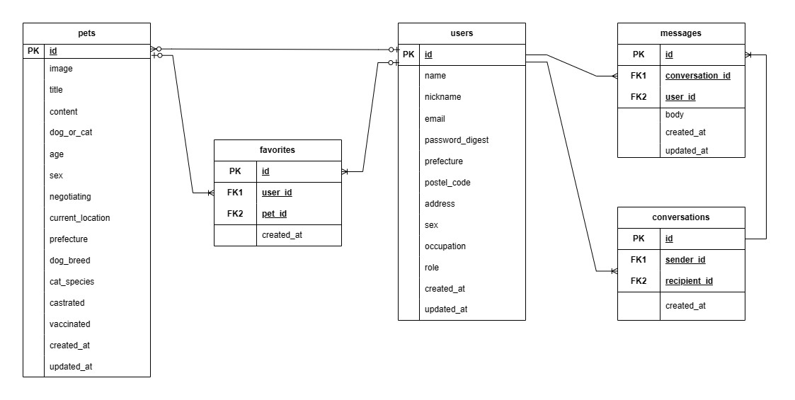

# README

## 開発言語
* Ruby 3.0.1
* Rails 6.1.6

## 就職Termの技術
* gem devise
* メッセージ機能
* お気に入り機能

## カリキュラム外の技術
* gem rails_admin
* gem cancancan
* ransack
* Google map API

## 実行手順
$ git clone git@github.com/Daashi888/Graduation_Task_one.git  
$ cd Graduation_Task_one  
$ bundle install  
$ rails db:create && rails db:migrate  
$ rails s  

## カタログ設計
https://docs.google.com/spreadsheets/d/17v3P5a8RdpVvNoqGI1u4bIV6LNqH18_LJaScGkjWtEk/edit#gid=1703073927

## テーブル定義書
https://docs.google.com/spreadsheets/d/17v3P5a8RdpVvNoqGI1u4bIV6LNqH18_LJaScGkjWtEk/edit#gid=1703073927

## ワイヤーフレーム
https://docs.google.com/spreadsheets/d/17v3P5a8RdpVvNoqGI1u4bIV6LNqH18_LJaScGkjWtEk/edit#gid=1703073927

## ER図

## 画面遷移図
